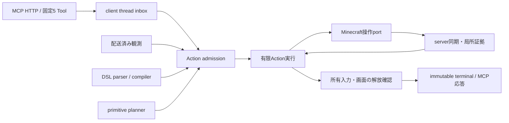

# コード案内

MCMCPはMinecraft **client内で完結するNeoForge MOD**です。HTTPから届いた要求をclient threadへ渡し、配送した観測の範囲内で有限のActionを実行します。最初にこの案内で責務を選び、該当する実装・テスト・仕様の節を読むと、全ファイルを読み直さずに変更を始められます。

安全契約は[AGENTS.md](../AGENTS.md)、公開5 Toolの正本は[Tool Catalog](MCMCP_MCP_Tool_Catalog.json)、詳細仕様は[設計仕様書](Minecraft_MCP_NeoForge_設計仕様書.md)です。この案内は仕様の代わりではありません。

## 要求から結果まで

配送ACKは「クライアントに観測を渡せた」という証拠です。操作成功に必要なserver ACKとは別に追跡します。予約・dispatch・操作直前の安全検証と、terminal公開前の入力解放を維持してください。

## 変更内容から入口を選ぶ

Javaの基点は [`src/main/java/dev/aod/mcmcp/`](../src/main/java/dev/aod/mcmcp/) です。テストも原則として [`src/test/java/dev/aod/mcmcp/`](../src/test/java/dev/aod/mcmcp/) の同名packageにあります。

| 変更したいこと | 主な実装 | 一緒に確認するもの |
| --- | --- | --- |
| Toolの必須field・公開説明・診断 | [`mcp/`](../src/main/java/dev/aod/mcmcp/mcp/)、Tool Catalog | schema・固定catalog hash・transport test |
| DSLの構文・分岐・有限予算 | [`agent/dsl/`](../src/main/java/dev/aod/mcmcp/agent/dsl/) | parser / validator / compiler / cursor test、Action DSLガイド |
| 行動の経路・照準・計画コスト | [`AgentPrimitivePlanner`](../src/main/java/dev/aod/mcmcp/agent/action/AgentPrimitivePlanner.java) と同packageのplanner | AgentPrimitivePlannerTest、該当operation test |
| HTTPからclient tickへ渡す処理 | [`runtime/`](../src/main/java/dev/aod/mcmcp/runtime/) のMcmcpRuntime、ClientCommandInbox | deadline・world session・cancel・evaluation lease test |
| 観測・配送TTL・再観測 | [`agent/observation/`](../src/main/java/dev/aod/mcmcp/agent/observation/)、runtime/ActionEvidence | frame/delivery/revision/fog recovery test |
| 直近の危険判定・回復候補 | [`agent/safety/`](../src/main/java/dev/aod/mcmcp/agent/safety/)、runtime/RecoveryPlanning | local safety・recovery・reconciliation test |
| container・建築などの1操作 | [`agent/action/`](../src/main/java/dev/aod/mcmcp/agent/action/) の該当Attempt、[`routine/`](../src/main/java/dev/aod/mcmcp/routine/) の該当Port | attempt/state machine test、Minecraft port contract test |
| ON/OFF・Esc・入力解放 | [`safety/`](../src/main/java/dev/aod/mcmcp/safety/)、[`client/`](../src/main/java/dev/aod/mcmcp/client/)、runtimeの終了処理 | terminal ordering・input release・evaluation interruption test |
| 評価の課題・判定・artifact | [`tools/eval/`](../tools/eval/)、[評価protocol](experiments/MCMCP_fresh_MCP-only_評価protocol.md) | mock capability gate、fixtureと本番操作の境界 |
| 接続診断・Tool結果の検証 | [`tools/mcp/`](../tools/mcp/) | test_*.py、McmcpTransportの失敗・ID照合 |

## 行動計画の分割

[`AgentPrimitivePlanner`](../src/main/java/dev/aod/mcmcp/agent/action/AgentPrimitivePlanner.java) は既存public APIとimmutableな結果型を保持する入口です。同packageの実装を直接探す場合は次を使います。

| 実装 | 責務 |
| --- | --- |
| AgentProgramPlanner | DSL順序、分岐・反復、姿勢伝播、有限作業量の所有 |
| AgentSurfaceEvidence | 配送済み観測・表面・itemの照合 |
| AgentNavigationPlanner / AgentPickupPlanner | 経路・接近計画、可視itemの回収経路 |
| AgentMutationPlanner / AgentConstructionPlanner | menu・mutation batch、建築・撤去・柱・redstone |
| AgentPlannerGeometry / AgentPlannerCosts | 視線・到達距離・角度、保守的なコストの計算・集約 |

対応するテストは `AgentPrimitivePlannerTest` です。たとえば `./gradlew test --tests '*AgentPrimitivePlannerTest'` で対象を絞れます。public APIの委譲で引数順・姿勢・証拠の保持を変えないことが境界です。

## 状態と実行処理の所有

[`runtime/`](../src/main/java/dev/aod/mcmcp/runtime/) では、寿命と安全境界が同じ状態を次の単位で扱います。

| クラス | 所有するもの・境界 |
| --- | --- |
| McmcpRuntime | client lifecycle、Actionのcommit・DSL進行・入力解放・terminal公開の調整 |
| ActionAdmission | clientからのsnapshot取得、workerのplanning、配送leaseの再検証。予約済みActionのcommitはruntimeに戻す |
| EvaluationLeaseController | 評価lease、同期fence、最初のterminal要求、control laneの非同期停止待機 |
| AgentObservations | 観測frame、配送証拠、音、局所地図とrevision。world境界でclearする |
| RoutineAdmission / RoutineLifecycle | 内部routineの受付、実行期限、音声owner、終了retryとcontinuation |
| MenuPrimitiveExecution | 1 Actionのcontainer・brewing・construction・pillar・redstone attempt。cleanupで未回収effectと使用量を回収 |
| FishingPrimitiveExecution | 1 Actionの釣りdispatch・bobber ACK・cleanup。未確認操作を再送しない |
| KillZoneExecution | 消費済み同意scope、攻撃ACK待機、再送禁止entity集合 |
| PrimitiveOutcome | 小さな進行結果。実行クラスは結果を返し、runtimeが次nodeまたは終了へ遷移させる |

`RuntimePrimitiveOwnershipContractTest` はcleanup順序とeffectの保存を、`McmcpRuntimeEvaluationTurnContractTest` はfenceと入力解放後のlease終了を検査します。新しい状態のownerを増やす場合も、この接続と終了順序を明示してください。

## 実行基盤の計算・変換モジュール

[`runtime/`](../src/main/java/dev/aod/mcmcp/runtime/) の次のクラスはpackage-privateです。McmcpRuntimeへ新しい静的helperを足す前に、対応する責務を探してください。異なる責務を横断するためだけの万能Contextや、汎用registryはありません。

| モジュール | 所有する責務 |
| --- | --- |
| ActionPlanning | DSL構造・初期primitive・構造上のコスト、接近計画の入口 |
| ActionBudgets | 残予算、再計画・mutationの有限再試行、overflowを避ける算術 |
| ActionPredicates | predicate依存関係とadmission時のimmutableな値 |
| ActionEvidence | 作物・額縁・音・表面の証拠、有効期限とrevision境界 |
| KnownBreakSafety / KillZoneSafety | 破壊・kill-zone固有の事前条件と証拠検査 |
| RecoveryPlanning | 回復候補、回復期限、下降追跡 |
| ConstructionRequests / InventoryRequests | 計画済み証拠から実行portの要求を構築 |
| PlayerInventoryEvidence | inventory・釣り・pickupの局所的な読み取り |
| ActionWireMapper | 状態・Action・menuの結果をMCP応答へ変換 |
| RuntimeArguments / RuntimeFailures | 型・値の検証、固定の公開失敗への変換 |
| RoutineArguments / RoutineIdentity / RoutineCatalog | 既存の内部routine互換経路の要求・同一性・一覧 |

`routine/` はすべて旧機能という意味ではありません。現在のActionもそこにあるMinecraft操作portや小さなoperationを利用します。削除時は実際の呼出元を確認してください。`McpToolSchemas` は内部routine入力schemaだけを保持し、固定5 Toolの正本はcatalog側にあります。

## 評価スクリプト

capability gateの入口は `Invoke-Mcmcp*CapabilityGate.ps1` です。共通支援を使うだけなら `McmcpCapabilityGateSupport.ps1` をdot-sourceします。

| ファイル群 | 責務 |
| --- | --- |
| McmcpCapabilityGateSupport / Transport / Observation / Action | script状態の初期化、既存通信、観測、予算・terminal・cleanup |
| McmcpConstructionNavigation / Placement | 移動、配置とstate-ref TTL |
| McmcpConstructionWallPlans / WallScenarios | 壁面・行Action・oracleの計画とシナリオ実行順 |
| McmcpConstructionScaffoldBuild / Navigation / Recovery | 仮設足場の構築・移動・撤去回収 |

共有ファイルにはparameter bindingや実行シナリオを置きません。`-LibraryOnly` の読込で通信・token読取・artifact作成を始めず、呼出元のscopeとmock transport差替えを維持します。`tools/mcp/McmcpTransport.ps1` とは現状の検証契約に差があるため、単純な置換はできません。

`run-build-gate.ps1` の旧routine呼出しは現在の固定5 Toolと互換ではありません。新規実装の雛形には使わず、capability gateと公開DSLを参照してください。

## 変更と検証の進め方

1. 対象の責務・公開契約・対応テストを先に選びます。Issueの専用worktreeで変更し、別の機能変更と同時に処理順や診断を変えません。
2. 機械的な移動では本体・定数・引数順を保ち、必要な依存を明示します。共有mutable stateを追加する前に、どの実行セッションが所有し、いつ破棄するかを決めます。
3. 対応テストを実行した後、`pwsh -File tools/check-source.ps1` でJava・transport・capability mockを検証します。Java 25、Python 3、PowerShell 7.4以上が必要です。これはゲームやfixtureを起動しません。初回Gradle依存取得には通信が必要です。
4. ASM/reflectionで安全な呼出順を確認しているテストでは、実装移動に合わせて検査対象を更新します。旧クラスに委譲だけを残して検査を通したり、安全assertionを削除したりしません。
5. 大きなファイルへ責務を追加したときは、この案内と[分割ノート](REFACTORING_NOTES.md)を更新します。行数は目安にし、状態所有・依存方向・1メソッドの判断の数もレビューします。

実機でのACK・fog・入力解放の確認はソース試験とは別です。配布前には評価protocolに沿った実機合格記録が必要です。
