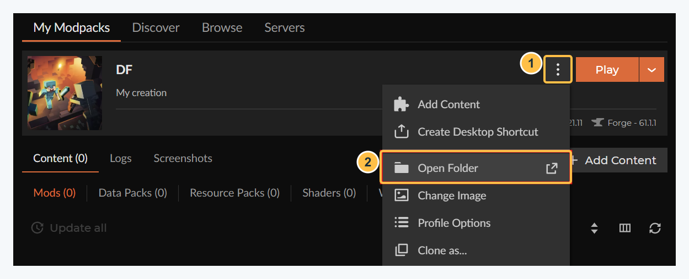
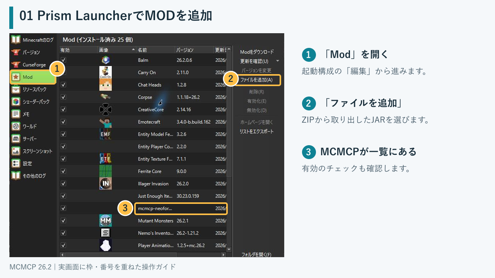
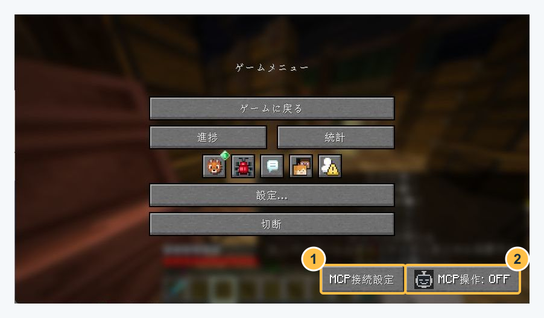
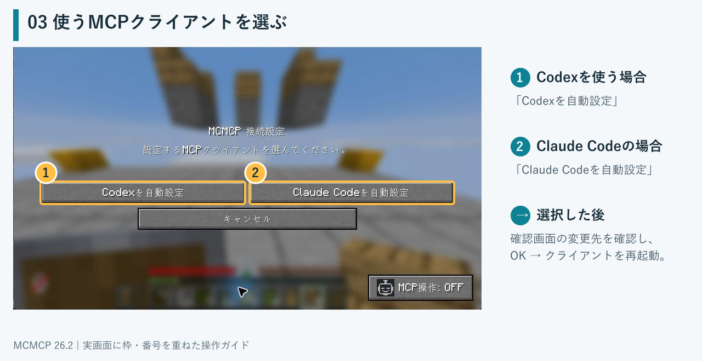
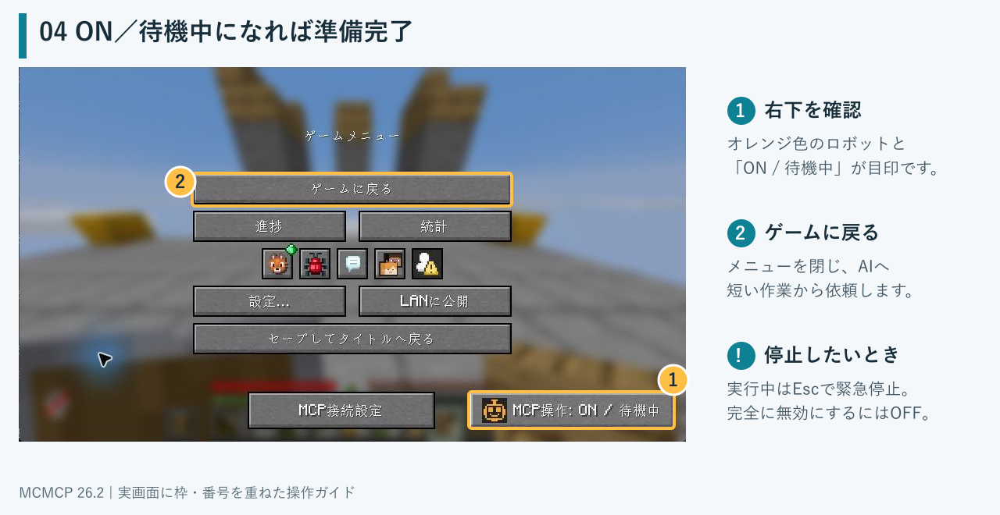
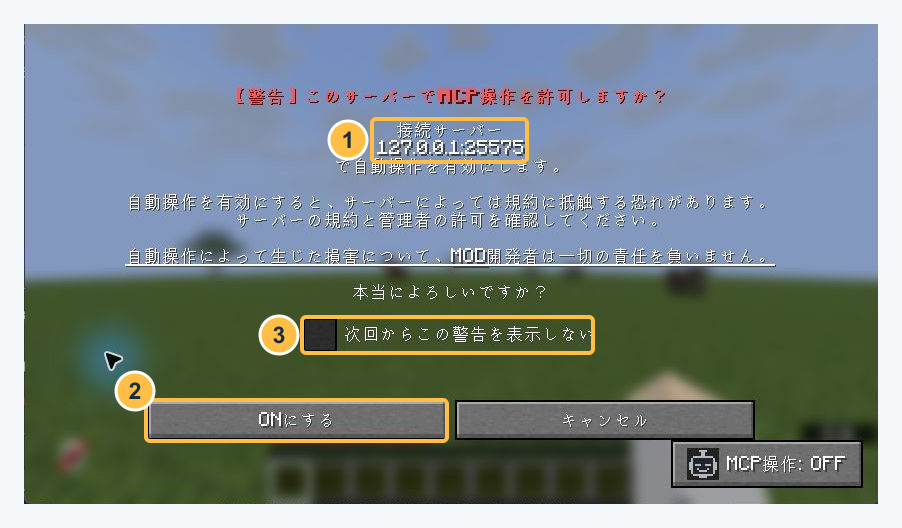

# MCMCP NeoForge 導入ガイド


**Minecraftのプレイヤーを、Codex・Claude Codeから操作するMODです。**

導入は **JARを追加 → MCPクライアントを接続 → 操作をON** の3ステップ。
MCPサーバーはMinecraft内で動くため、サーバー側MODや別の中継プログラムは不要です。

**対応環境・配布版**

- Minecraft **26.2** / NeoForge **26.2.0.59** / Java **25**
- Minecraftと同じPCで動作するCodex・Claude CodeなどのMCPクライアント
- MODの配布版：**0.1.0-SNAPSHOT**（開発版）

**読み方：** そのまま読む場合は **README.pdf** を開いてください。

**同梱物：** MOD本体のJAR、`README.pdf`、`README.md`、画像フォルダー `assets/readme/`、Action DSLガイド、ライセンス・出典・ソース取得先、チェックサム。Markdown版を移動するときは画像フォルダーも一緒に置いてください。

## 目次

| 章・項目 | PDFページ |
| --- | ---: |
| 1. MODを導入する / 1.1 CurseForgeの場合 | 2 |
| 1.2 Prism Launcherの場合 | 3 |
| 2. MCPクライアントを接続する / 2.1 接続設定を開く | 4 |
| 2.2 自動設定を行う / 2.3 MCPクライアントを再起動する | 5 |
| 3. 操作をONにして、AIへ依頼する / 3.1 各アイコンにおけるMODの状態 | 6 |
| 4. マルチプレイでの操作許可 | 7 |
| 5. 困ったとき / トラブルシューティング | 8 |

<div style="page-break-after: always;"></div>

## 1. MODを導入する

### 1.1 CurseForgeの場合

くらふとぶ！の案内に従って導入した**既存のプロフィール**を使います。Prismを使っている方は次のページへ進んでください。



**画面の見方**

- **①「⋮」：** プロフィールのメニューを開くボタンです。
- **② Open Folder：** そのプロフィールのゲームフォルダーを開きます。

**導入手順**

1. **Minecraftを終了**し、配布ZIPを展開します。
2. CurseForgeの **Minecraft → My Modpacks** で使うプロフィールを開き、**「⋮」→「Open Folder」**を選びます。
3. 開いたフォルダーの **`mods`** に、同梱の `mcmcp-neoforge-26.2-0.1.0-SNAPSHOT.jar` をコピーします。
4. CurseForgeに戻り、**Play** で起動します。

**更新時：** 古いMCMCP JARを `mods` の外へバックアップしてから差し替えます。

> [!NOTE]
> 画面は[CurseForge公式ブログ](https://blog.curseforge.com/how-to-enable-mods-for-a-specific-world-in-minecraft-java/)の参考例です。表示中のDF／Forgeの構成は使わず、**Minecraft 26.2／NeoForge 26.2.0.59** のプロフィールを選んでください。配布ZIPはMODパックのインポート用ではありません。

<div style="page-break-after: always;"></div>

### 1.2 Prism Launcherの場合

Prismを使っている方はこちらの手順です。CurseForgeで追加済みの場合は「2. MCPクライアントを接続する」へ進みます。



**画面の見方**

- **① Mod：** 選択した起動構成のMOD一覧です。
- **② ファイルを追加：** 手元のJARを起動構成に追加するボタンです。
- **③ MCMCPの項目：** 左のチェックで有効・無効を切り替えます。

**導入手順**

1. **Minecraftを終了**し、配布ZIPを展開します。
2. Prism Launcherで使う起動構成を選び、**「編集」→「Mod」→「ファイルを追加」**へ進みます。
3. 同梱の `mcmcp-neoforge-26.2-0.1.0-SNAPSHOT.jar` を追加し、Minecraftを起動します。

**更新時：** 古いMCMCP JARを `mods` の外へバックアップしてから差し替えます。同じMODを2つ入れないでください。既存の設定・認証情報は引き継げます。

ほかのランチャーの場合は、使用するゲームフォルダーの `mods` へJARを入れてください。

<div style="page-break-after: always;"></div>

## 2. MCPクライアントを接続する

### 2.1 接続設定を開く

ワールドまたはサーバーへ入り、**Esc**でメニューを開きます。**MCP操作はデフォルトでOFFになっています。**



**画面の見方**

- **① MCP接続設定：** MCPクライアントの設定選択画面を開きます。
- **② MCP操作: OFF：** 自動操作のON・OFFを切り替えるボタンです。

**「MCP接続設定」を押すと、MCPクライアントの設定選択画面に移行します。**

<div style="page-break-after: always;"></div>

### 2.2 自動設定を行う

設定選択画面で、**使うクライアントの自動設定ボタン**を押します。



**画面の見方**

- **① Codexを自動設定：** CodexのMCP接続設定を追加する確認画面を開きます。
- **② Claude Codeを自動設定：** Claude CodeのMCP接続設定を追加する確認画面を開きます。

表示された確認画面で変更先を確認して、**「OK」**を押します。

### 2.3 MCPクライアントを再起動する

**設定後はCodex／Claude Codeを完全に終了し、起動し直してください。** Minecraftは起動したままにします。

接続先は既定で `http://127.0.0.1:8765/mcp`。Claude Code用の設定は、Claude Desktopには使えません。設定ファイルの詳細は本ガイド末尾に記載しています。

> **Note — 別のアプリを開きながら使う場合**
>
> Minecraftで **F3＋P**（初期キー設定）を押し、フォーカス喪失時の一時停止が**無効**になった表示を確認してください。有効だと、AIがチェストを閉じた直後にメニューが自動で開き、続く操作が止まることがあります。もう一度押すと戻せます。設定は保存され、通常プレイにも適用されますが、**手動Escの緊急停止は引き続き使えます。**

<div style="page-break-after: always;"></div>

## 3. 操作をONにして、AIへ依頼する

メニュー右下の「**MCP操作: OFF**」を押します。「**ON / 待機中**」になったら「ゲームに戻る」を押してください。



**画面の見方**

- **① ON / 待機中：** MCP操作が有効な状態です。押すとOFFに切り替わります。
- **② ゲームに戻る：** メニューを閉じて、ゲーム画面に戻ります。

最初は状態確認から始めます。AIへ次のように依頼してください。

```text
MCMCPで現在の状態と所持品を確認してください。
まだ行動は開始しないでください。
```

状態を取得できたら、具体的な短い作業を依頼します。**Actionが終了してもONを維持するため、続けて作業を依頼できます。**ワールドへ入り直した場合は、改めて操作をONにしてください。チャット画面を開いているだけではMCP操作は停止しません。

**止めるとき：実行中はEscで緊急停止。自動操作を無効にするにはMCP操作をOFFにします。**

### 3.1 各アイコンにおけるMODの状態

| アイコン | 状態 | アイコン | 状態 |
| --- | --- | --- | --- |
|  | OFF |  | ON／待機中 |
|  | 推論中（評価機能） |  | 実行中 |
|  | 緊急回避中 |  | 攻撃確認中 |
|  | FAULT／内部異常 | | |

<div style="page-break-after: always;"></div>

## 4. マルチプレイでの操作許可

サーバーへ接続して初めてMCP操作をONにすると、確認画面が表示されます。



**画面の見方**

- **① 接続先サーバー：** 操作許可の対象となるサーバーの接続先を表示します。
- **② ONにする：** この接続先でMCP操作を許可するボタンです。キャンセルするとOFFを維持します。
- **③ 次回からこの警告を表示しない：** この接続先での次回以降の確認を省略するチェック項目です。

**許可の手順**

1. **接続先を確認**し、そのサーバーの規約と管理者の許可を確認します。
2. 許可されている場合は **「ONにする」** を押します。許可できない場合はキャンセルします。
3. **「次回からこの警告を表示しない」** は、その接続先の確認を省略したい場合だけ選んでください。

撮影例の `127.0.0.1:25575` は、このガイド専用の一時ローカルサーバーです。実際には参加するサーバーの接続先が表示されます。MCMCP用の接続先 `127.0.0.1:8765/mcp` とは用途が異なります。

Minecraftサーバー側へのMCMCPの導入は不要です。MCPクライアントは、MCMCPを入れたMinecraftと同じPCで動かします。

**マルチプレイではEscメニューを開いてもワールドは停止しません。** 安全な場所で設定してください。

Prism Launcher・Minecraftの画像は実際に撮影した画面に枠と番号を重ねたものです。CurseForgeは出典付きの公式参考画像を使用しています。ボタンの位置は画面サイズや導入MODにより異なる場合があります。

<div style="page-break-after: always;"></div>

## 5. 困ったとき / トラブルシューティング

| 症状 | 確認すること |
| --- | --- |
| ツールが表示されない／接続拒否 | Minecraftを先に起動し、MCPクライアントを再起動します。複数の起動構成で同じポートを同時に使うことはできません。 |
| `401 Unauthorized` | 別の起動構成の認証情報を参照していないか確認します。現在のゲームから接続設定をやり直してください。 |
| `InvalidToolCall` | 古いMCMCP JARを外し、このZIPのJARに差し替えてMinecraftを再起動します。 |
| タイトル画面にボタンがない | ワールドへ入ってからEscを押します。 |
| 自動設定で競合が表示される | 手動登録した `mcmcp` 設定を確認します。既存設定をバックアップし、接続先を確認してください。 |
| 弓やポーションを長押しできない／観測が更新されない | この配布版には修正が含まれます。JARの差し替えだけでなく、Minecraftの再起動まで行ってください。 |
| チェストを閉じた後にメニューが開く／次の操作が止まる | F3＋Pでフォーカス喪失時の一時停止を無効にし、開いたメニューからゲームに戻って再試行します。マルチプレイでも自動メニューが操作を妨げる場合があります。 |

### 5.1 設定と認証情報

自動設定はCodexの `~/.codex/config.toml`、Claude Codeの `~/.claude.json` を更新します。既存ファイルは初回に `.mcmcp.bak` としてバックアップされます。

認証情報はゲームフォルダーの `config/mcmcp/mcp-token` に保存され、自動設定で参照されます。**このファイルや実際のトークンを、配布物・チャット・問い合わせ用ログに含めないでください。**

開発元・ソースコード：[Aodaruma/mcmcp](https://github.com/Aodaruma/mcmcp)

MCMCPのソースコードは **MPL 2.0** で提供します。詳細は配布物の`LICENSE`・`NOTICE.md`を参照してください。

**Minecraft / Mojang / Microsoftの公式製品ではありません。**
NOT AN OFFICIAL MINECRAFT MOD. NOT APPROVED BY OR ASSOCIATED WITH MOJANG OR MICROSOFT.
